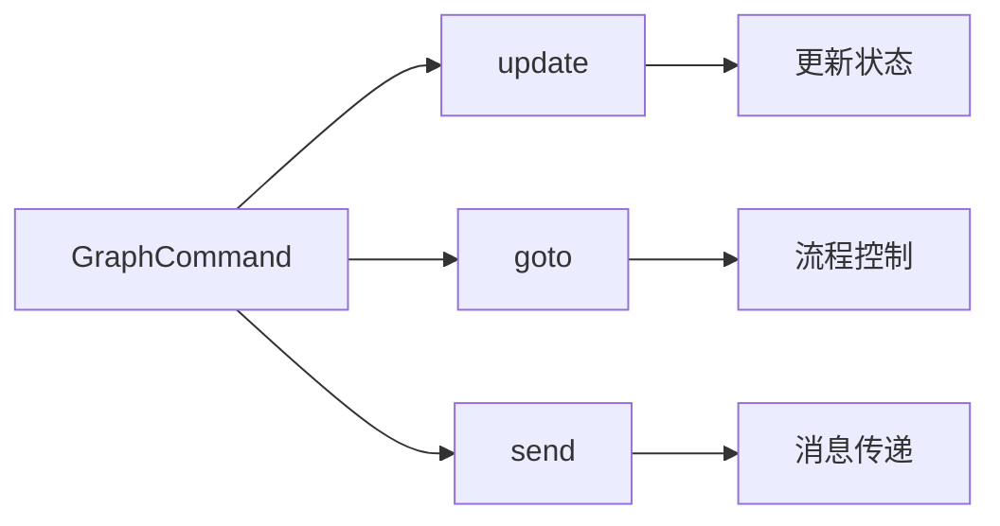
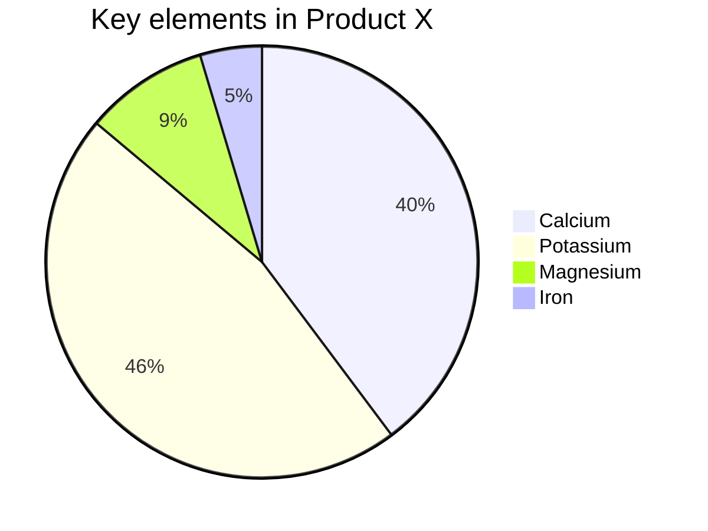
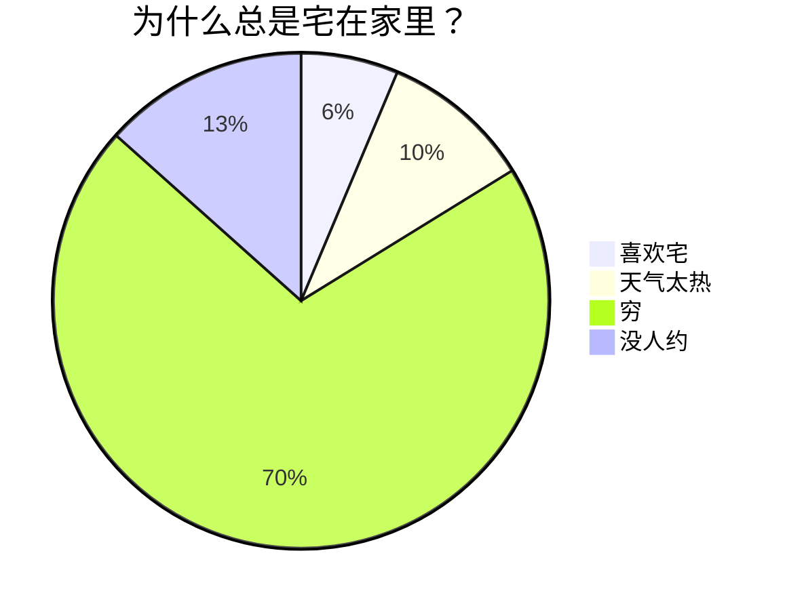

# 💫 关于为什么会开发这款软件

> 🤔 你是否也曾为公众号排版烦恼？
> 
> 📝 每天和文字打交道，却在排版上浪费大量时间？
> 
> 🔍 找到了好用的开源编辑器，但总觉得少了点什么？

这几天几乎每天和公众号打交道，我太懂这种痛了！在一次偶然的机会，我发现了 [doocs/md](https://github.com/doocs/md) 这款超棒的开源编辑器。但转念一想：「嘿！都 2025 年了，AI 这么火，为啥还要辛辛苦苦手写所有内容呢？」

就是这个灵光一闪的想法，让我开始了这次有趣的二次开发之旅~ 🚀

## ✨ 我们做了什么？

- 🤖 接入了强大的 AI 助手功能
- ✍️ 支持一键智能优化文章表达
- 🎭 添加了文章伪原创功能
- 📱 支持一键导入微信公众号文章
- 🎨 还有更多实用功能正在开发中...

## 🎁 给大家的福利

为了让更多创作者体验到 AI 创作的乐趣，我们提供了免费的 API Key！没错，你现在就可以免费使用 GPT-3.5 模型来辅助创作。（虽然不是最新的 GPT-4，但对于日常创作来说，已经足够给力啦！）

## 🔮 未来计划

- 🔓 开放自定义 API 接入
- 🚀 支持更多 AI 模型
- 💡 持续收集用户反馈，打造更多实用功能

> 💝 特别感谢 [doocs/md](https://github.com/doocs/md) 提供的优秀开源项目，让我们能够站在巨人的肩膀上，为创作者带来更好的写作体验！


# 🚀 为什么选择我们的 Markdown 编辑器？

欢迎使用这款强大的 Markdown 编辑器！我们致力于为您提供最优雅、高效的写作体验。无论您是技术写作者、内容创作者，还是热爱写作的普通用户，这里都能满足您的所有需求。

## ✨ 核心特色

### 🎯 智能 AI 助手
- **AI 续写**：写作卡壳？让 AI 帮您继续创作
- **智能优化**：一键优化文章表达，让内容更专业流畅
- **伪原创**：支持多种文风转换，保持文章原意的同时赋予新的表达方式

### 📱 微信公众号助手
- **一键导入**：轻松导入微信公众号文章，自动转换为 Markdown 格式
- **格式完美保留**：图片、表格、代码块等样式自动处理
- **智能排版**：自动优化文章结构，让排版更专业

### 🎨 个性化主题
- **多种主题**：支持明暗两种模式，多种颜色主题随心切换
- **实时预览**：所见即所得，写作时即可预览最终效果
- **自定义样式**：支持自定义 CSS，打造专属写作风格

### 💡 便捷功能
- **快捷键支持**：丰富的快捷键支持，让写作更高效
- **图片上传**：支持剪贴板图片直接粘贴上传
- **数学公式**：支持 LaTeX 数学公式
- **流程图**：支持 Mermaid 流程图
- **导出多格式**：支持导出为 HTML、纯文本等多种格式

## 🌟 适用场景

- 📝 技术文档写作
- 📚 博客文章创作
- 📖 知识库管理
- 📰 公众号写作
- 📋 日常笔记记录
- 🎯 项目文档维护

## 🔥 为什么选择我们？

1. **专注写作体验**：简洁的界面设计，让您专注于内容创作
2. **智能辅助创作**：AI 助手让写作更轻松，创作更高效
3. **完整工具链**：从创作到发布的完整工具支持
4. **持续更新迭代**：定期推出新功能，持续优化用户体验
5. **安全可靠**：本地存储，数据安全有保障

## 🎉 立即开始

现在就开始体验这款强大的 Markdown 编辑器吧！无论您是初学者还是专业用户，这里都能帮助您创作出优质的内容。

## AI 功能配置教程

在使用 AI 功能之前，您需要进行以下配置：

### 1. 获取 API Key
当前免费提供（只能使用gpt-3.5-turbo）：sk-GXdHfAUByeKFBu2BSHbcHI5Y2RYNRtJZ9rmQv5iyK3f1zEaw
1. 访问[天马座 API](https://api.puzhehei.top/) 官网
2. 注册/登录您的账号
3. 在个人中心获取您的 API Key
4. 复制并保存您的 API Key（以 sk- 开头）

### 2. 配置 API Key

1. 点击编辑器右上角的"AI 助手"
2. 选择"OpenAI 设置"
3. 在 API Key 输入框中粘贴您的 Key
4. 可选：调整温度（较低的值使输出更加确定，较高的值使输出更加创造性）
5. 可选：调整最大长度（控制生成内容的长度限制）

### 3. 使用 AI 功能

编辑器支持以下 AI 功能：

#### 3.1 AI 继续编写

1. 选中需要继续编写的文本
2. 右键点击，选择"AI继续编写"
3. AI 将基于选中的内容智能续写，生成的内容会直接插入到光标位置

> 提示：适用于需要扩展、延伸现有内容的场景，AI 会根据上下文保持文风的连贯性

#### 3.2 AI 优化表达

1. 选中需要优化的文本
2. 右键点击，选择"AI优化表达"
3. AI 将优化选中内容的表达方式，结果将显示在原文下方

优化内容会：
- 使表达更加专业流畅
- 保持原文核心意思不变
- 优化段落结构和逻辑
- 增加必要的过渡词

#### 3.3 AI 伪原创

1. 选中需要改写的文本
2. 右键点击，选择"AI伪原创"
3. 在弹出的对话框中设置：
   - 改写程度：低、中、高
   - 文风选择：学术性、新闻类、通俗化等
   - 保留要素：可选择保留关键词、数据等
   - 其他要求：可添加特定的改写要求

特点：
- 支持分段处理长文本
- 保持文章结构的连贯性
- 可自定义改写风格和程度
- 支持多种专业领域改写

> 注意：对于较长的文本，AI 功能会自动分段处理，每段不超过 2000 字，以确保处理质量。如遇到处理失败，建议减少选中文本长度后重试。

> 提示：如果遇到 API 错误，请检查：
> 1. API Key 是否正确（应以 sk- 开头）
> 2. API Key 是否有效或额度是否用尽
> 3. 如需更高请求限制，请访问天马座 API 官网升级账户

## 微信公众号文章一键导入

编辑器支持一键导入微信公众号文章，轻松将公众号内容转换为 Markdown 格式。

### 1. 使用步骤

1. 打开需要导入的微信公众号文章
2. 复制文章链接（以 `mp.weixin.qq.com` 开头的链接）
3. 点击编辑器左上角的「文件->导入公众号文章」
4. 在弹出的对话框中粘贴文章链接
5. 点击「导入」按钮，等待处理完成

### 2. 导入说明

导入过程会自动：
- 提取文章标题和正文内容
- 保留文章的格式和样式
- 处理文章中的图片
- 优化代码块的显示
- 保持列表和表格的结构
- 转换为标准 Markdown 格式

### 3. 注意事项

- 仅支持微信公众号文章的链接（以 `mp.weixin.qq.com` 开头）
- 导入过程中请保持网络连接稳定
- 如遇导入失败，可以尝试：
  1. 检查链接是否正确
  2. 确认文章是否可以正常访问
  3. 刷新页面后重试
  4. 若文章较长，可能需要稍等片刻

> 提示：导入完成后，建议检查内容是否完整，特别是图片、表格等特殊元素的显示情况。

---

# 探索 Markdown 的奇妙世界

欢迎来到 Markdown 的奇妙世界！无论你是写作爱好者、开发者、博主，还是想要简单记录点什么的人，Markdown 都能成为你新的好伙伴。它不仅让写作变得简单明了，还能轻松地将内容转化为漂亮的网页格式。今天，我们将全面探讨 Markdown 的基础和进阶语法，让你在这个过程中充分享受写作的乐趣！

Markdown 是一种轻量级标记语言，用于格式化纯文本。它以简单、直观的语法而著称，可以快速地生成 HTML。Markdown 是写作与代码的完美结合，既简单又强大。

## Markdown 基础语法

### 1. 标题：让你的内容层次分明

用 `#` 号来创建标题。标题从 `#` 开始，`#` 的数量表示标题的级别。

```markdown
# 一级标题

## 二级标题

### 三级标题

#### 四级标题
```

以上代码将渲染出一组层次分明的标题，使你的内容井井有条。

### 2. 段落与换行：自然流畅

Markdown 中的段落就是一行接一行的文本。要创建新段落，只需在两行文本之间空一行。

### 3. 字体样式：强调你的文字

- **粗体**：用两个星号或下划线包裹文字，如 `**粗体**` 或 `__粗体__`。
- _斜体_：用一个星号或下划线包裹文字，如 `*斜体*` 或 `_斜体_`。
- ~~删除线~~：用两个波浪线包裹文字，如 `~~删除线~~`。

这些简单的标记可以让你的内容更有层次感和重点突出。

### 4. 列表：整洁有序

- **无序列表**：用 `-`、`*` 或 `+` 加空格开始一行。
- **有序列表**：使用数字加点号（`1.`、`2.`）开始一行。

在列表中嵌套其他内容？只需缩进即可实现嵌套效果。

- 无序列表项 1
  1. 嵌套有序列表项 1
  2. 嵌套有序列表项 2
- 无序列表项 2

1. 有序列表项 1
2. 有序列表项 2

### 5. 链接与图片：丰富内容

- **链接**：用方括号和圆括号创建链接 `[显示文本](链接地址)`。
- **图片**：和链接类似，只需在前面加上 `!`，如 ``。

[访问 Doocs](https://github.com/doocs)


轻松实现富媒体内容展示！

> 因微信公众号平台不支持除公众号内容以外的链接，故其他平台的链接，会呈现链接样式但无法点击跳转。

> 对于这些链接请注意明文书写，或点击左上角「格式->微信外链接转底部引用」开启引用，这样就可以在底部观察到链接指向。

### 6. 引用：引用名言或引人深思的句子

使用 `>` 来创建引用，只需在文本前面加上它。多层引用？在前一层 `>` 后再加一个就行。

> 这是一个引用
>
> > 这是一个嵌套引用

这让你的引用更加富有层次感。

### 7. 代码块：展示你的代码

- **行内代码**：用反引号包裹，如 `code`。
- **代码块**：用三个反引号包裹，并指定语言，如：

```js
console.log("Hello, Doocs!");
```

语法高亮让你的代码更易读。

### 8. 分割线：分割内容

用三个或更多的 `-`、`*` 或 `_` 来创建分割线。

---

为你的内容添加视觉分隔。

### 9. 表格：清晰展示数据

Markdown 支持简单的表格，用 `|` 和 `-` 分隔单元格和表头。

| 项目人员                                    | 邮箱                   | 微信号       |
| ------------------------------------------- | ---------------------- | ------------ |
| [yanglbme](https://github.com/yanglbme)     | contact@yanglibin.info | YLB0109      |
| [YangFong](https://github.com/YangFong)     | yangfong2022@gmail.com | yq2419731931 |
| [thinkasany](https://github.com/thinkasany) | thinkasany@gmail.com   | thinkasany   |

这样的表格让数据展示更为清爽！

> 手动编写标记太麻烦？我们提供了便捷方式。左上方点击「编辑->插入表格」，即可快速实现表格渲染。

## Markdown 进阶技巧

### 1. LaTeX 公式：完美展示数学表达式

Markdown 允许嵌入 LaTeX 语法展示数学公式：

- **行内公式**：用 `$` 包裹公式，如 $E = mc^2$。
- **块级公式**：用 `$$` 包裹公式，如：

$$
\begin{aligned}
d_{i, j} &\leftarrow d_{i, j} + 1 \\
d_{i, y + 1} &\leftarrow d_{i, y + 1} - 1 \\
d_{x + 1, j} &\leftarrow d_{x + 1, j} - 1 \\
d_{x + 1, y + 1} &\leftarrow d_{x + 1, y + 1} + 1
\end{aligned}
$$

这是展示复杂数学表达的利器！

### 2. Mermaid 流程图：可视化流程

Mermaid 是强大的可视化工具，可以在 Markdown 中创建流程图、时序图等。








这种方式不仅能直观展示流程，还能提升文档的专业性。

> 更多用法，参见：[Mermaid User Guide](https://mermaid.js.org/intro/getting-started.html)。

## 结语

Markdown 是一种简单、强大且易于掌握的标记语言，通过学习基础和进阶语法，你可以快速创作内容并有效传达信息。无论是技术文档、个人博客还是项目说明，Markdown 都是你的得力助手。希望这篇内容能够带你全面了解 Markdown 的潜力，让你的写作更加丰富多彩！

现在，拿起 Markdown 编辑器，开始创作吧！探索 Markdown 的世界，你会发现它远比想象中更精彩！

#### 推荐阅读

- [阿里又一个 20k+ stars 开源项目诞生，恭喜 fastjson！](https://mp.weixin.qq.com/s/RNKDCK2KoyeuMeEs6GUrow)
- [刷掉 90% 候选人的互联网大厂海量数据面试题（附题解 + 方法总结）](https://mp.weixin.qq.com/s/rjGqxUvrEqJNlo09GrT1Dw)
- [好用！期待已久的文本块功能究竟如何在 Java 13 中发挥作用？](https://mp.weixin.qq.com/s/kalGv5T8AZGxTnLHr2wDsA)
- [2019 GitHub 开源贡献排行榜新鲜出炉！微软谷歌领头，阿里跻身前 12！](https://mp.weixin.qq.com/s/_q812aGD1b9QvZ2WFI0Qgw)

---

<center>
    
</center>
